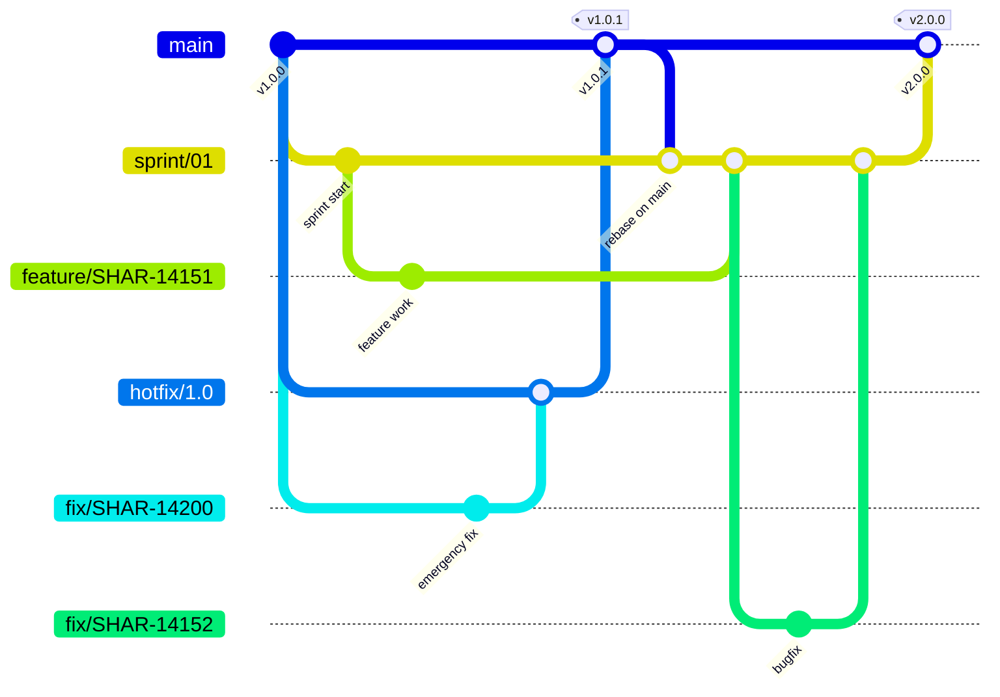

# Git Workflow & Conventions

Standard git workflow and conventions for this project. All commits and branches must follow these guidelines.

## Versioning Strategy

This project uses **sprint-based versioning**:

- **Major version** = Sprint number (sprint/01 = v1.x, sprint/02 = v2.x)
- **Minor version** = Count of hotfixes during the sprint (hotfix/1 = v1.1, hotfix/1.2 = v1.2, etc.)
- **Patch version** = Emergency fixes to main outside of sprint cycle

**Note:** Version numbers do not indicate semantic versioning (breaking changes). They only indicate which sprint the release came from and how many hotfixes were applied.

**Examples:**
- Sprint 1 release: `v1.0.0`
- Emergency hotfix during sprint 1: `v1.0.1`, then `v1.0.2`, etc.
- Sprint 2 release: `v2.0.0`
- Emergency hotfix during sprint 2: `v2.0.1`, then `v2.0.2`, etc.

## Branching Strategy (Overview)

This project uses a multi-level branching strategy:



### Branch Types & Purpose

| Branch Type | Pattern | Created From | Merges To | Purpose |
|-------------|---------|--------------|-----------|---------|
| **Main** | `main` | — | Release only | Stable, production-ready code |
| **Sprint Stage** | `sprint/##` | `main` | `main` (release) | Staging for sprint, collects work |
| **Hotfix Stage** | `hotfix/#.#` (major.minor only) | `main` | `main` (patch release) | Emergency production fix stage |
| **Ticket** | `(feature\|fix\|tech)/<TICKET>` | Stage or main | Stage or main (PR/MR) | Short-term development work |

### Normal Workflow (Sprint Release)

Standard flow for developing features, fixes, and technical work during a sprint:

```
1. Create sprint stage branch from main
   $ git checkout main
   $ git pull
   $ git checkout -b sprint/01

2. Create ticket branch from stage branch
   $ git checkout sprint/01
   $ git checkout -b feature/SHAR-14151

3. Commit and push with upstream tracking
   $ git push -u origin feature/SHAR-14151

4. Create PR/MR from ticket branch → stage branch
   (feature/SHAR-14151 → sprint/01)

5. Merge to stage branch after approval

6. Repeat steps 2-5 for other tickets in sprint
   (feature/SHAR-14152, fix/SHAR-14153, tech/SHAR-14154, etc.)

7. When sprint is complete, create PR/MR from stage → main
   (sprint/01 → main)

8. After merge to main, tag the sprint release
   $ git tag v1.0.0
   $ git push origin v1.0.0

9. Deploy the release
```

### Emergency Hotfix Workflow (Patch Release)

**Only for critical production bugs that need immediate fixing. Rare scenario.**

Creates patch versions (v1.0.1, v1.0.2, etc.) during sprint cycle.

```
1. Create ticket branch DIRECTLY from main
   $ git checkout main
   $ git pull
   $ git checkout -b fix/SHAR-14200

2. Commit and push with upstream tracking
   $ git push -u origin fix/SHAR-14200

3. Create PR/MR from ticket branch → main
   (fix/SHAR-14200 → main)

4. After merge to main, tag the patch release
   $ git tag v1.0.1
   $ git push origin v1.0.1

5. Deploy the patch release
```

### Rare: Feature/Tech in Hotfix

Occasionally, non-critical feature or tech work may need to be deployed via hotfix (e.g., database migrations, configuration changes). This is exceptional and should be avoided when possible.

```
1. Create hotfix stage branch from main
   $ git checkout main
   $ git pull
   $ git checkout -b hotfix/1.0

2. Create ticket branch from hotfix (not from main)
   $ git checkout hotfix/1.0
   $ git checkout -b feature/SHAR-14250

3. Commit and push with upstream tracking
   $ git push -u origin feature/SHAR-14250

4. Create PR/MR from ticket branch → hotfix
   (feature/SHAR-14250 → hotfix/1.0)

5. After merge and approval, create PR/MR from hotfix → main
   (hotfix/1.0 → main)

6. Tag the patch release
   $ git tag v1.0.2
   $ git push origin v1.0.2

7. Deploy the release
```

### Key Rules

- **Ticket branches** are short-lived (hours to days) - created from either sprint or hotfix branches
- **Sprint stage branches** (`sprint/##`) persist for the sprint cycle and collect all sprint work
- **Hotfix branches** (`hotfix/#.#`) only use major.minor (e.g., `hotfix/1.0`), never patch version
- **Feature and Tech tickets** belong in sprint branches (normal workflow)
- **Bug fixes** can be in sprint or in emergency hotfixes
- **Emergency hotfixes** are rare and only for critical production bugs that bypass sprint cycle
- **Versioning** = Sprint number (major) + Hotfix count (minor) + Emergency count (patch)
  - `v1.0.0` = Sprint 1 release
  - `v1.1.0` = Sprint 1 + hotfix 1 (from `hotfix/1.1` branch)
  - `v1.0.1` = Sprint 1 + 1 emergency fix (direct to main)
  - `v1.1.1` = Sprint 1 + hotfix 1 + 1 emergency fix
  - `v2.0.0` = Sprint 2 release
- **Main branch** is protected - only accepts merges from sprint or hotfix branches with release tags
- Each **PR/MR must reference the JIRA ticket** in the title
- Always use **upstream tracking** (`-u` flag) on first push

## Branch Naming Convention

All branches must follow this strict pattern:

```
<type>/<JIRA-TASK>
```

Where:
- **`<type>`** is one of: `feature`, `fix`, or `tech`
- **`<JIRA-TASK>`** is the JIRA ticket number (e.g., `SHAR-14151`)

### Valid Examples
- ✅ `feature/SHAR-12345` - New feature for ticket SHAR-12345
- ✅ `fix/SHAR-14151` - Bug fix for ticket SHAR-14151
- ✅ `tech/SHAR-99999` - Technical task/refactoring for ticket SHAR-99999

### Invalid Examples
- ❌ `mybugfix` - No prefix or ticket
- ❌ `feature-SHAR-14151` - Wrong separator (should be `/`)
- ❌ `SHAR-14151` - Missing type prefix
- ❌ `feature/my-branch` - Missing JIRA ticket

### Type Definitions

| Type | Purpose | When to Use |
|------|---------|-----------|
| `feature` | New features | Adding new functionality |
| `fix` | Bug fixes | Fixing bugs or regressions |
| `tech` | Technical work | Refactoring, dependencies, DevOps, tooling |

## Commit Message Format

All commits must follow this format:

```
<Type>: <Description> [<TICKET-ID>]

<Long description - multiple lines OK>
```

### Components

#### 1. Type (Required)
One of: `Fix`, `Tech`, or `Feature`

Must match the intent:
- `Fix` - For bug fixes
- `Tech` - For refactoring, dependencies, DevOps, tooling
- `Feature` - For new functionality

#### 2. Description (Required)
- Clear, lowercase start
- Action-oriented (describe what was changed, not narrative)
- Concise (ideally 50-60 characters, max 72 with context)

**Good descriptions:**
- ✅ "prevent trailing backslash query injection in Genetec driver"
- ✅ "allow guests to call agreements endpoint"
- ✅ "update Laravel dependencies to v12"

**Bad descriptions:**
- ❌ "I fixed the bug where the Genetec driver had issues with backslashes"
- ❌ "Fixed stuff"
- ❌ "WIP: random changes"

#### 3. Ticket ID (Required)
Extract from branch name: `fix/SHAR-14151` → `[SHAR-14151]`

#### 4. Long Description (Strongly Encouraged)
Multiple lines explaining the changes. Include:
- **What** was changed
- **Why** it was changed
- **How** it was changed
- Any side effects or considerations

**Balance is key:** The long description should be detailed enough to provide context for future maintainers, but concise enough to be readable. Aim for 2-5 lines that explain the reasoning and impact, not a novel. Future developers reading git history should understand the "why" without getting lost in unnecessary details.

The long description is critical for code review and future maintenance.

### Example Commits

```
Fix: allow guests to call agreements endpoint [SHAR-14151]

Modified CheckValidAuthCredentials middleware to allow both 'api' and 'guests' guards.
Guests can now access agreements list, show, and history endpoints.
Write operations (create, update, delete) remain restricted to authenticated users.
```

```
Tech: update Laravel dependencies [SHAR-12340]

Updated to Laravel 12.x with PHP 8.4 compatibility.
All tests passing. No breaking changes to API.
```

```
Feature: add dark mode toggle to settings [SHAR-99887]

Added theme context provider for state management.
Created theme switcher component in settings page.
Updated CSS variables for light and dark modes.
```

## Push & Upstream Tracking

### Always use `-u` flag

```bash
git push -u origin <branch-name>
```

The `-u` flag:
- Sets the upstream branch explicitly
- Enables future `git push` without specifying the branch
- Is required on first push for any branch

### Why `-u` is mandatory

- Prevents accidental pushes to wrong branches
- Makes it clear which remote branch you're tracking
- Required for CI/CD and automated workflows
- Enables `git pull` without branch specification

### Verify upstream is set

```bash
git branch -vv
```

Your branch should show: `[origin/<branch-name>]` (with brackets = tracked)

Example output:
```
* feature/SHAR-14151    abc1234 [origin/feature/SHAR-14151] your commit message
  main                  def5678 [origin/main] some other commit
```

## Forbidden `git add` Forms

These forms regularly stage unrelated files and are **not allowed**:

| Form | Why forbidden |
|------|---------------|
| `git add -A` | Adds everything including untracked — highest-risk form |
| `git add .` | Adds everything in current directory — depends on CWD, surprises common |
| `git add -u` | Adds all tracked changes — pulls in unrelated edits (e.g. config drift) |

**Use instead:**
- `git add <path> [<path> ...]` — explicit paths
- `git add -p` — interactive hunk-by-hunk selection

**Why this matters:** Multiple incidents have been caused by `-A` / `.` including the wrong files in a commit, requiring reset + re-commit cleanup.

## Pull Request / Merge Request Guidelines

### PR Title Format

Use the same format as commit messages:

```
<Type>: <Description> [<TICKET-ID>]
```

**Examples:**
- ✅ "Fix: prevent trailing backslash injection in Genetec driver [SHAR-14151]"
- ✅ "Feature: add dark mode toggle to settings [SHAR-99887]"

### PR Description

Include:
1. **Summary** - What changed and why
2. **Testing** - How to test/verify the changes
3. **Links** - Link to the JIRA ticket
4. **Breaking Changes** - Any API or behavior changes

**Template:**
```
## Summary
Brief description of changes.

## Testing
Steps to verify the changes work:
1. Step 1
2. Step 2

## Links
[SHAR-14151](https://jira.example.com/browse/SHAR-14151)

## Breaking Changes
None / Description of breaking changes
```

### PR Requirements

Before creating a PR:
- [ ] Branch follows naming convention (`feature/fix/tech` + ticket)
- [ ] All commits follow message format (Type: Description [TICKET])
- [ ] Upstream tracking is set (`git push -u origin`)
- [ ] Tests pass locally
- [ ] Code follows project style guidelines
- [ ] No debug code or console.log statements
- [ ] PR description is complete

## Common Scenarios

### Scenario: Wrong branch name, changes not pushed yet

```bash
# Create correct branch
git branch -m old-branch-name feature/SHAR-14151

# Verify
git branch --show-current  # Should show: feature/SHAR-14151

# Push to new branch
git push -u origin feature/SHAR-14151
```

### Scenario: Committed with wrong message format

```bash
# Fix the most recent commit (not pushed yet)
git reset --soft HEAD~1

# Stage changes again (explicit paths only — never `git add .` / `-A` / `-u`)
git add <specific-file-1> <specific-file-2>

# Commit with correct format
git commit -m "$(cat <<'EOF'
Fix: correct description [SHAR-14151]

Explanation of changes.
EOF
)"
```

### Scenario: Forgot to use `-u` on push

```bash
# Even if you already pushed without -u, just run:
git push -u origin <branch-name>

# This updates the tracking
git branch -vv  # Verify tracking is now set
```

### Scenario: Need to squash multiple commits

```bash
# If you have 3 commits that should be 1:
git reset --soft HEAD~3

# Stage changes (explicit paths only — never `git add .` / `-A` / `-u`)
git add <specific-file-1> <specific-file-2>

# Create single commit with full message
git commit -m "$(cat <<'EOF'
Fix: your description [SHAR-14151]

Detailed explanation of all changes.
EOF
)"
```

## Red Flags - Stop and Fix

These indicate a workflow violation:

| Red Flag | Fix |
|----------|-----|
| Used `git add -A` / `git add .` / `git add -u` | `git reset`, then stage explicit paths per file |
| Branch name is just `mybugfix` without prefix/ticket | Delete commits, check out correct branch, re-commit |
| Commit message doesn't start with Fix/Tech/Feature | Use `git reset --soft HEAD~1`, commit again correctly |
| Commit message is missing ticket ID in brackets | Use `git reset --soft HEAD~1`, commit again correctly |
| Commit message missing detailed description | Use `git reset --soft HEAD~1`, commit again correctly |
| Ran `git push` without the `-u` flag | Run `git push -u origin <branch>` to set upstream |
| Pushed to wrong branch | Contact project maintainer - may need force push |

## The Golden Rule

**All three requirements MUST be met before pushing:**

1. ✅ Branch name follows pattern: `<type>/<TICKET>`
2. ✅ Commit message follows format: `<Type>: <Description> [<TICKET>]` with long description
3. ✅ Push uses upstream tracking: `git push -u origin <branch>`

If any requirement is not met, the workflow is invalid. Fix it immediately, do not work around it.
