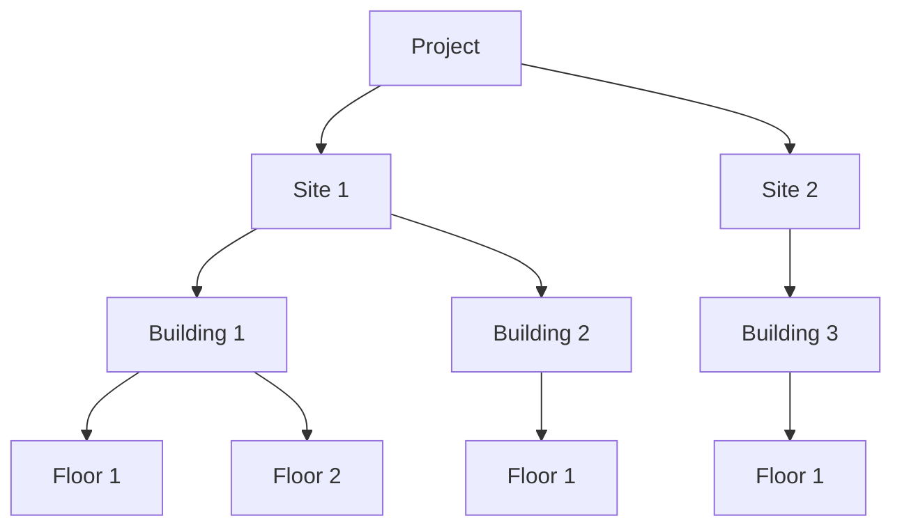

# Business Terminology & Glossary

This document defines key business and architectural terms used throughout the Sharry Backend Monorepo.

## Company & Platform

**Sharry**
: A PropTech (property technology) company that provides a cloud-based workplace experience platform for managing physical security and workplace access. The Sharry platform enables organizations to modernize their physical security by replacing traditional plastic ID cards with mobile credentials accessible through smartphones and smartwatches (Apple Wallet, Google Wallet, etc.).

  **Key capabilities**:
  - Digital employee badges and mobile access credentials
  - Visitor management with QR code guestpasses
  - Smart parking management
  - Hybrid work space booking system
  - Integrates with 20+ existing access control systems (both modern and legacy)
  - Real-time occupancy analytics and workplace data
  - White-label and customizable solutions for different customer types

  **Product lines**:
  - **Sharry Workplace for Enterprises** — for companies managing employee access across multiple locations
  - **Sharry Building for Landlords** — for building/property managers managing tenant and visitor access

  **Compliance & Security**:
  - ISO 27001:2022 certified
  - GDPR and CCPA compliant
  - Focuses on sustainability by eliminating plastic badges
  - Supports 300,000+ users globally across clients including American Express, Amazon, and Citibank

**Sharry Platform** (within architectural context)
: The backend system (the codebase for this monorepo) that powers Sharry's cloud-based workplace experience. Serves multiple independent customers as a multi-tenant SaaS application where each customer (Property Manager) gets their own isolated instance and can manage their own organizational hierarchy of tenants.

## SaaS & Multi-Tenancy

**Project**
: A customer/tenant instance within the Sharry SaaS platform. Each project appears as a separate, fully-branded installation with its own:
  - Custom design, colors, images, branding
  - Isolated settings and configuration
  - Separate user base (users belong to one project only)
  - Isolated data within Complex, logically separated database
  - Logically isolated microservice data (via project_id, building_id, destination_id, or destination_key)

**Multi-Tenant SaaS**
: Single codebase serving multiple independent customers (projects). Each project is logically isolated while sharing the same underlying application code and infrastructure.

**Cluster**
: Geographic deployment region:
  - `euw1-main` = Europe
  - `use2` = North and South America

**Project Instance**
: A deployed instance of a project within a specific cluster.

## Data & Configuration

**Settings MS**
: Microservice storing basic project definitions and configuration. Central location for project-specific settings.

**AWS S3**
: Shared object storage for all project assets (images, documents, files). Single bucket for all projects.

**Complex Database**
: Logically separated database per project within the Complex application. Each project has isolated data.

**Shared Tables**
: Tables in microservices that contain data for all projects, with project isolation via:
  - `project_id` - Direct project reference
  - `building_id` - Reference to building (which belongs to a project)
  - `destination_id` - Reference to destination/location
  - `destination_key` - Key identifying a project destination

**User Microservice**
: Special case: maintains separate database schemas per project (unlike other microservices using shared tables with project_id).

## Users & Access

**User** (Employee)
: Employee or permanent member. Has long-term or permanent access to the system and building(s). Can access the Sharry application with their assigned badge(s). Belongs to exactly one project.
  - Has a **Current Location** (linked to a Floor) - their primary work location
  - May have access to multiple **Assigned Locations** (Sites/Buildings/Floors) and can switch between them if working in multiple offices
  - Can view their current location in the app and switch to other assigned locations

**Host**
: A User who invites Guest(s) to access a building. The host creates and manages invitations.

**Guest** (Visitor)
: Visitor with temporary access granted by a Host. Has short-term access (typically hours). Guest access can be revoked early if they leave before the invitation expires. Guests have minimal permissions - they can only access the building(s) covered by their active invitation.
  - Linked to a specific **Floor** through the Invitation (reception check-in)
  - Can only access the floor(s) specified in their invitation

**Member**
: Parent/abstract entity representing any person who can have access (either a User or Guest). Encompasses both permanent employees and temporary visitors. Members can participate in invitations and have badges.

**Invitation** (Guestbook)
: A time-bound access grant created by a Host. Can include multiple Guests/Members. Represents a visit or event period. Guests can access the building(s) during the invitation validity period. Can be revoked before expiration if guests leave early.

## Badge Types & Providers

**Badge Type**
: The credential format used to prove identity and grant access. Supported types:
  - `BIOMETRIC` - Biometric credential (fingerprint, face, etc.)
  - `PLASTIC` - Physical plastic card
  - `QR_CODE` - QR code credential
  - `VIRTUAL` - Digital credential delivered via mobile app/wallet
  - `LICENSE_PLATE` - Vehicle license plate recognition
  - `STICKER` - Physical sticker credential

**Virtual Card Provider**
: Service that manages digital badge delivery. Sharry integrates with multiple providers for flexibility:
  - **HID** - Standalone HID cards
  - **HID Wallet** - Apple Wallet and Google Wallet integration
  - **Salto** - Salto systems integration
  - **STID** - STID systems integration
  - **Brivo** - Brivo systems integration
  - **Biostar** - Biostar systems integration
  - **Gallagher** - Gallagher systems integration
  - **Wawelynx** - Wawelynx systems integration

All providers support similar badge functionality, normalized through Sharry's integration layer.

**Card**
: Actual credential stored in a destination access system. Each card:
  - Belongs to exactly ONE destination system
  - Has a card number (transformed by Driver formatters to the system's required format)
  - Has a status representing its lifecycle state
  - Is a physical/logical instance of a credential

**Card Status** (AccessCardStateEnum)
: Lifecycle state of a card:
  - `ACTIVATING` - Card is being activated in the destination system
  - `ACTIVE` - Card is active and can be used for access
  - `DEACTIVATING` - Card is being deactivated
  - `INACTIVE` - Card is inactive and cannot be used
  - `UNSUPPORTED` - The destination system does not support this card type

**Badge**
: Logical collection of Cards representing the same credential across multiple destination systems. All cards in a badge:
  - Have the same badge type (QR, BIOMETRIC, VIRTUAL, PLASTIC, etc.)
  - Have the same base card number (transformed per destination system's format by Drivers)
  - Are automatically replicated to each destination system
  - Result: one Card per destination system, grouped under one Badge

**Example**:
- Create a QR Badge with card number "16" for Destinations A and B
- Result: 1 Badge (type QR) containing 2 Cards
  - Card 1: Destination A, card number "16"
  - Card 2: Destination B, card number "16"

**Driver Formatter**
: Component in a Driver that transforms card numbers and other data into the specific access system's required format (e.g., Wiegand format). Ensures cards work correctly with legacy and modern systems despite their different specifications.

## Organization Structure

**Project Company Hierarchy**
: Every project has its own organizational hierarchy of companies structured as a tree:
  - **Level 1 (Top)**: Always "Sharry" (the platform itself)
  - **Level 2**: Property Manager (exactly one per project) - manages physical infrastructure and buildings
  - **Level 3+**: Tenants and sub-tenants (each with permission to create sub-entities below them)

**Company**
: An organizational entity within the project hierarchy. Can be:
  - Sharry (top level)
  - Property Manager (level 2)
  - Tenant (level 3+)
  - Sub-tenant (nested under a tenant, with appropriate permissions)

**Property Manager**
: Exactly one company at level 2 of the hierarchy per project. Manages the physical buildings/infrastructure and coordinates access across the property. **The Property Manager is the direct customer of Sharry** - they subscribe to the platform and manage their own tenants within it.

**Tenant**
: Company at level 3 or below in the hierarchy. Can create sub-tenants if granted permission. Typically rents/operates within the property managed by the Property Manager.

## Location Hierarchy

**Site**
: Root node in the location hierarchy. Represents a physical location grouping - can be a complex of buildings, a town, a campus, etc. Each project contains multiple sites.

**Building**
: Physical building under a Site. Each building contains one or more Floors.

**Floor**
: Physical floor within a Building. Lowest level in the location hierarchy. Currently, there are no sub-levels under floors.

**Location Hierarchy Structure** (Rigid)
: Every project has multiple Sites, each containing Buildings, each containing Floors:



**Location Access Control**
: Company access to locations is determined by the company hierarchy level:
  - **Sharry & Property Manager**: Access to all locations
  - **Tenants**: Have an allow list of specific Buildings or Floors they can access

**Destination Limitation**
: A destination (access system) can be limited to specific locations via Keychain. For example:
  - A company may have access to Building A and Building B (via allow list)
  - But a specific destination (e.g., main entrance) may be limited to Building A only
  - So users can only access that destination in Building A, even if they have building-level access

**Keychain**
: Access control tool that determines which Users and Guests can use a specific destination. Uses four independent filter fields that are combined with AND logic:
  - **Inclusive Companies**: List of companies allowed to use the destination (OR within the list)
  - **Exclusive Companies**: List of companies prohibited from using the destination
  - **Inclusive Locations**: List of locations (sites/buildings/floors) allowed to use the destination (OR within the list)
  - **Exclusive Locations**: List of locations prohibited from using the destination

  **Access Logic** (all conditions must be met):
  ```
  (inclusive_companies empty OR user in inclusive_companies) AND
  (inclusive_locations empty OR user in inclusive_locations) AND
  (user NOT in exclusive_companies) AND
  (user NOT in exclusive_locations)
  ```

  If an inclusive field is empty, it means "no restriction" for that field (matches everyone). Exclusive fields always restrict when populated.

  **Examples**:
  - All fields empty: Everyone can use this destination
  - Inclusive Companies [A, B] only: Users from company A or B can use it (regardless of location)
  - Inclusive Locations [Floor1, Floor2] only: Users/guests at Floor1 or Floor2 can use it (regardless of company)
  - Both set: Users must be from (A or B) AND physically at (Floor1 or Floor2)

## Core Business Value

Sharry is a bridge to access control systems. It integrates with diverse access systems - both modern and legacy - normalizing their different interfaces and capabilities into a unified experience.
