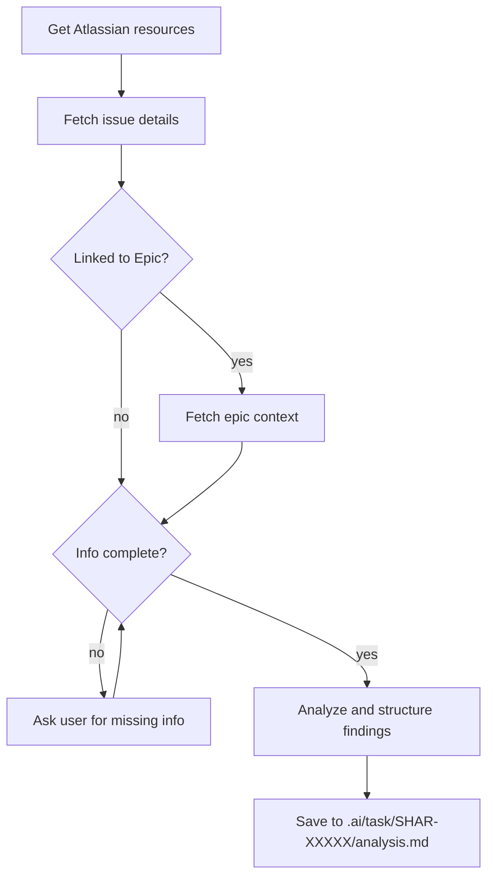

# Analyzer Skill

## Overview

This skill analyzes Jira issues (e.g., SHAR-1234) and provides structured analysis **without any code implementation**. It helps clarify requirements, identify assumptions, and list questions before development begins.

## Complexity Estimation Guidelines

When estimating complexity, consider these factors:

### Complexity Levels
- **Low** (2-4 hours): Simple changes, single file, well-defined pattern exists, minimal testing
  - Example: Add validation to existing form field, fix typo in logic, update configuration

- **Medium** (4-8 hours / ~1 day): Multiple files, some research needed, moderate testing
  - Example: Add new API endpoint following existing pattern, refactor service class, add feature with tests

- **High** (1-2 days): Cross-service changes, architectural decisions, extensive testing, integration work
  - Example: Migrate logic between services, add new microservice integration, refactor core functionality

- **Very High** (2+ days): Major architectural changes, multiple services, significant unknowns, complex integration
  - Example: Replace entire subsystem, add new driver/integration from scratch, major database migration

### Factors That Increase Complexity
- **Multiple services affected** (microservices, complex, packages)
- **New patterns** (no existing example to follow)
- **Integration with external systems** (third-party APIs, drivers)
- **Database migrations** (schema changes, data transformation)
- **Backwards compatibility requirements** (supporting old and new versions)
- **Extensive testing needed** (integration tests, manual testing across multiple scenarios)
- **Cross-cutting concerns** (permissions, caching, error handling)
- **Unknowns** (need to research approach, unclear requirements)

### Factors That Decrease Complexity
- **Existing pattern to follow** (similar feature already implemented)
- **Single service/package** (contained scope)
- **Well-defined requirements** (clear acceptance criteria)
- **No external integrations** (internal code only)
- **No database changes** (pure logic changes)
- **Minimal testing** (unit tests only)

### Task Size Assessment

**Ideal task size**: 4-8 hours (~1 working day)
- Can be completed in single focused session
- Easy to review
- Clear scope
- Reduced context switching

**When to split**:
- Estimated effort > 1 day (8 hours)
- Multiple independent concerns (can be done separately)
- Natural breaking points exist (e.g., backend + frontend, service + tests, migration + feature)
- Reduces risk (smaller changes easier to review and roll back)

**How to split**:
- By layer: Backend logic → Frontend UI → Integration tests
- By service: Access MS changes → Complex changes → Guestbook changes
- By concern: Database migration → Feature implementation → Testing & validation
- By independence: Part A has no dependencies on Part B

**Subtask suggestions**:
- Each subtask should be independently completable
- Each subtask should have clear acceptance criteria
- Estimate complexity for each subtask separately
- Order subtasks by dependencies (if any)

---

## Process



## Instructions

### When analyzing a Jira issue:

1. **Get Atlassian resources** to identify the cloudId:
   - Use `mcp__atlassian__getAccessibleAtlassianResources`
   - Extract the cloudId from available resources
   - **Note**: Since the issue key is provided directly as an argument, there is no need to use search. Go directly to step 2.

2. **Fetch the issue details directly** (DO NOT use Rovo Search):
   - **CRITICAL**: Do NOT use `mcp__atlassian__search` (Rovo Search) - it may not be available in all Atlassian instances
   - Use `mcp__atlassian__getJiraIssue` directly with the cloudId and the provided issue key (e.g., SHAR-14107)
   - Extract all relevant fields: title, description, type, status, priority, assignee, labels, linked issues, comments

   - **Actively retrieve additional context**:
     - If the issue has **comments**, fetch them: Use `mcp__atlassian__getConfluencePageFooterComments` or equivalent to get discussion context
     - If the issue has **linked issues**, fetch the linked issues to understand relationships and dependencies
     - If the issue has a parent/subtask relationship, fetch parent issue for context
     - If description is missing or minimal, ask user: "The issue description is minimal/missing. Would you like me to search for related documentation or linked pages?"
     - If critical fields are blank (acceptance criteria, requirements), note this as a missing item to ask about

   - **Important**: Check if the issue is linked to an **Epic**. If yes, fetch the epic details too:
     - Epic often contains broader context, strategic goals, and detailed requirements
     - The epic may define the feature scope, business context, or multi-issue roadmap
     - Include epic details in the "Epic Context" section of Understanding
     - **Crucial**: Understand that THIS TASK is only a SUBSET of the epic - not the entire epic scope applies to this task
     - Use the epic to understand context and goals, but focus analysis on what THIS specific task needs to accomplish

3. **Ask for missing information BEFORE analyzing** (be proactive):
   - If the issue description is empty or too brief, ASK the user to provide context
   - If acceptance criteria or requirements are not documented, ASK the user to clarify them
   - If critical linked issues or epic details cannot be fetched, ASK the user to provide them
   - If business context or purpose is unclear, ASK the user to explain the "why"
   - If there are vague requirements, ASK specific questions to clarify scope
   - **Ask one question at a time**: When seeking clarification, ask a single focused question rather than multiple questions at once
     - This prevents user confusion and enables clear, specific answers
     - After receiving an answer, ask the next follow-up question based on their response
   - **Example**: "The acceptance criteria are not documented in this issue. Could you please provide them? What should indicate that this task is complete?"
   - **Example**: "This issue references system X but doesn't explain the integration points. Could you clarify how this task interacts with system X?"

4. **Analyze the issue and structure findings**:

   ### Understanding Section
   - **Summary**: One-sentence description of what needs to be done
   - **Requirements**: Breakdown of individual requirements from the description (for THIS task only, not the entire epic)
   - **Success Criteria**: Acceptance criteria, definition of done, or test cases mentioned (for THIS task only)
   - **Technical Scope**: Which services/components are affected (complex, microservices, packages) - only for THIS task. If multiple services are involved, include a Mermaid diagram showing their relationships.
   - **Epic Context** (if applicable):
     - Link to parent epic and epic's high-level goals
     - Explain how THIS task fits into and contributes to the larger epic
     - Note: The epic scope is broader - only this task's portion is relevant to this analysis
   - **Context**: Related issues, blockers, or dependencies

   ### Assumptions Section
   - **Framework/Library Choices**: Technology decisions implied by the issue
   - **Integration Points**: Other systems or services that may be involved
   - **Data Model**: Implied schema or data structure changes
   - **Permission/Access**: Access control or security implications
   - **Performance**: Any performance constraints or optimizations needed
   - **Backwards Compatibility**: Whether this breaks existing functionality

   ### Questions Section
   - **Clarifications**: Ambiguities in requirements that need resolution
   - **Missing Information**: What's not specified but needed to implement
   - **Edge Cases**: Boundary conditions or error scenarios to handle
   - **User Preferences**: Decisions that depend on team/product preferences
   - **Constraints**: Any limitations on approach or timeline

   ### Complexity Assessment Section
   - **Estimated Complexity**: Low / Medium / High / Very High (based on guidelines above)
   - **Estimated Effort**: Time estimate in hours/days (e.g., "4-6 hours", "1-2 days")
   - **Complexity Factors**: List factors that increase or decrease complexity
   - **Task Size Recommendation**:
     - If <= 1 day: "Appropriately sized for single task"
     - If > 1 day: "Consider splitting into subtasks"
   - **Suggested Subtasks** (if task should be split):
     - For each subtask: Title, Complexity, Effort, Scope, Acceptance Criteria
     - Note any dependencies between subtasks

5. **Output format**: Structured markdown with these four main sections

6. **Save analysis to file** (REQUIRED):
   - Create directory structure: `.ai/task/SHAR-XXXXX/` (where XXXXX is the issue key)
   - Save the complete analysis markdown to: `.ai/task/SHAR-XXXXX/analysis.md`
   - Use the Write tool to create the file (it will create directories automatically)
   - This preserves the analysis for future reference and planning
   - **Example paths**:
     - `.ai/task/SHAR-14107/analysis.md`
     - `.ai/task/SHAR-13881/analysis.md`

7. **Critical Guidelines**:
   - **ASK FOR MISSING INFO**: Be proactive! If critical information is missing (description, requirements, AC, links), ask the user to provide it BEFORE analyzing
   - **TASK SCOPE**: Analyze THIS TASK only, not the entire epic. Epic provides context, but this task is only a subset of epic scope
   - **COMPLEXITY ASSESSMENT**: Always estimate complexity and effort; suggest subtask split if > 1 day
   - **SUBTASK SUGGESTIONS**: If splitting recommended, provide specific subtask breakdown with individual estimates
   - **REALISTIC ESTIMATES**: Base estimates on similar tasks in the codebase, consider unknowns, include testing time
   - **NO ROVO SEARCH**: Always use `mcp__atlassian__getJiraIssue` directly with the issue key - never use `mcp__atlassian__search`
   - **NO CODE GENERATION**: Do not write any code, pseudocode, or implementation examples
   - **FILE SAVING ONLY**: The ONLY files you modify are the analysis.md files saved to `.ai/task/SHAR-XXXXX/`; do not modify, create, or suggest changes to other project files
   - **NO IMPLEMENTATION PLANNING**: Do not provide specific implementation steps
   - **ANALYSIS ONLY**: Focus purely on understanding requirements and identifying gaps
   - **ACTIONABLE QUESTIONS**: List specific, answerable questions

## Output Format

```markdown
# Analysis of SHAR-XXXXX

## Understanding

**Summary**: [One-line description]

**Requirements**:
- [Requirement 1]
- [Requirement 2]

**Success Criteria**:
- [Criterion 1]
- [Criterion 2]

**Technical Scope**:
- Services: [complex, microservices/access, packages/common, etc.]
- Components: [Specific modules/classes affected]
- Integration: [External systems]

**Epic Context** (if applicable):
- Epic: [Epic Key and Title]
- Epic Goals: [High-level goals from epic]
- How This Task Fits: [How this specific task contributes to achieving epic goals]
- Note: This task is a subset of the broader epic scope

**Context**:
- Assigned to: [Name]
- Priority: [Priority level]
- Status: [Current status]
- Related: [Linked issues]

## Assumptions

**Framework/Technology**:
- [Assumption 1]

**Integration Points**:
- [Assumption 2]

**Data Model**:
- [Assumption 3]

**[Other relevant categories]**:
- [Assumption N]

## Questions

**Clarifications**:
- [Question about ambiguous requirement]
- [Question about unclear scope]

**Missing Information**:
- [What's not specified]
- [What needs definition]

**Edge Cases**:
- [Error scenario to clarify]
- [Boundary condition]

**[Other categories as relevant]**:
- [Additional question]

## Complexity Assessment

**Estimated Complexity**: [Low / Medium / High / Very High]

**Estimated Effort**: [X-Y hours or X-Y days]

**Complexity Factors**:
- [Factor that increases complexity]
- [Factor that increases complexity]
- [Simplifying factor if any]

**Task Size Recommendation**:
[Appropriately sized for single task (~1 day or less)]
OR
[Consider splitting into subtasks - estimated effort > 1 day]

**Reasoning**:
[Brief explanation of complexity assessment and why it is/isn't split]

**Suggested Subtasks** (if splitting recommended):

1. **[Subtask 1 Title]**
   - Complexity: [Low/Medium/High]
   - Effort: [X hours]
   - Scope: [What this subtask includes]
   - Acceptance Criteria: [What defines done for this subtask]

2. **[Subtask 2 Title]**
   - Complexity: [Low/Medium/High]
   - Effort: [X hours]
   - Scope: [What this subtask includes]
   - Acceptance Criteria: [What defines done for this subtask]

**Dependencies**: [If subtasks have order dependencies, note them here]
```

## Examples

### Example 1: Analyze a Feature Request

**Ask**: `/analyze-jira SHAR-13881`

**Expected Output**:
```markdown
# Analysis of SHAR-13881

## Understanding

**Summary**: Implement alert media read confirmation system

**Requirements**:
- Users should be able to mark media alerts as read
- Read status must persist across sessions
- Need to track read/unread state per user per alert

...etc
```

### Example 2: Analyze a Bug

**Ask**: `/analyze-jira SHAR-14107`

**Expected Output**:
```markdown
# Analysis of SHAR-14107

## Understanding

**Summary**: Assign correct complex label for scrappers based on destination system

**Requirements**:
- Scrapper labels must match the destination system
- Each destination system has its own label
- Need to validate labels during scrapper configuration

...etc
```

## Key Points

- **Analysis-focused**: Your output should help readers understand the requirement, not implement it
- **Question-driven**: Ask clarifying questions that need answers before coding
- **Scope identification**: Help identify what's included and excluded
- **Assumption documentation**: List decisions that should be validated with the team
- **Zero implementation**: No code suggestions, file changes, or implementation steps

## When to Use This Skill

- ✅ Need to understand a ticket before starting work
- ✅ Help other team members understand the scope
- ✅ Identify gaps or ambiguities in requirements
- ✅ Document assumptions before building
- ✅ Plan discovery without implementation
- ❌ Don't use for: Implementing the solution
- ❌ Don't use for: Writing code or tests
- ❌ Don't use for: Editing project files

## Integration with Your Workflow

1. Pick up ticket from sprint
2. Run `/analyze-jira SHAR-XXXXX`
3. Review Understanding/Assumptions/Questions
4. Analysis is automatically saved to `.ai/task/SHAR-XXXXX/analysis.md` for future reference
5. Discuss questions with team/product owner
6. When clear, proceed with implementation

## Tips

- The skill works best with well-written Jira descriptions
- **Always check for Epic links** - the epic often contains crucial business context and requirements
- **Remember**: This task is a SUBSET of the epic - use epic for context and understanding larger goals, but focus analysis on THIS task only
- **Be proactive about missing information**: Don't just note missing pieces - ASK the user to provide them
  - If description is empty → ask for it
  - If acceptance criteria are missing → ask for them
  - If requirements are vague → ask for clarification
  - If linked issues cannot be retrieved → ask the user to provide them
- **When asking clarification questions**: Ask one question at a time, not multiple questions in one prompt
  - This prevents user confusion and ensures clear, focused answers
  - After answering one question, ask the next follow-up based on their response
- Include comments in the Jira issue for context
- Use labels and linked issues for relationships
- The analysis is only as complete as the ticket information
- If an issue is part of an epic, read the epic's description carefully - it may clarify requirements, scope, and constraints for understanding context
- Don't try to implement the entire epic - only THIS task's requirements matter for this analysis
- **Fetch comments and linked issues** to understand full context and relationships
- **Complexity estimation tips**:
  - Look at similar completed tasks in the codebase for reference estimates
  - Consider unknowns - add buffer for research/investigation time
  - Don't forget testing time (often 30-40% of implementation time)
  - Cross-service changes are always more complex than they appear initially
  - If unsure between two complexity levels, choose the higher one (better to overestimate)
  - Include time for code review feedback and fixes in estimates
- **Splitting tasks**:
  - Natural split: Backend implementation → Frontend implementation
  - Natural split: Database migration → Feature using the migration
  - Natural split: Core logic → Integration with existing features → Testing
  - Each subtask should deliver value independently when possible
  - Aim for subtasks that are 2-6 hours each (half-day chunks)
  - Consider team capacity: splitting enables parallel work across team members
