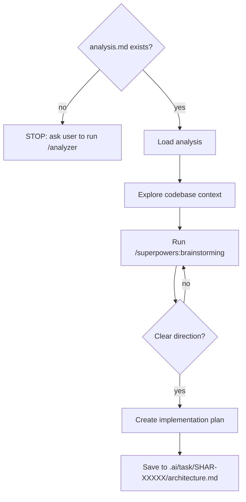

# Technical Implementation Architect Skill

## Overview

This skill creates detailed technical implementation plans for Jira issues. It takes the requirements and transforms them into:
- Architectural decisions and trade-offs
- Step-by-step implementation strategy
- Files to create, modify, or delete
- Testing approach
- Database/schema changes (if needed)
- Integration points and dependencies
- Potential challenges and solutions

**Prerequisites**: Run `/analyze-jira SHAR-XXXXX` first to clarify requirements. Then run this skill with the same issue key.

## Process



## Instructions

### When creating an implementation plan:

1. **Load prior analysis** (REQUIRED):
   - Check if `.ai/task/SHAR-XXXXX/analysis.md` exists (where XXXXX is the issue key)
   - If it EXISTS: Read and load it - this contains all the Understanding/Assumptions/Questions from `/analyze-jira`
   - If it MISSING: Ask the user to run `/analyze-jira SHAR-XXXXX` first. Do not proceed without the analysis.
   - **Critical**: The analysis file is your only source of requirements. Do NOT call Jira APIs directly.
   - Extract from analysis: Summary, Requirements, Success Criteria, Technical Scope, Epic Context, Assumptions, Questions

2. **Understand the codebase context** (thorough exploration required):

   **Start with documentation:**
   - Read `CLAUDE.md` - Overview of monorepo structure, services, and tooling
   - Read `.ai/guidelines.md` - Architecture patterns, namespacing, testing conventions
   - Skim relevant README files in the affected service/package directories

   **Explore the affected service(s) using the Explore agent:**
   - Use `Task` tool with `subagent_type=Explore` and `thoroughness="very thorough"` to investigate:
     - Service structure and key directories
     - Existing providers, services, and how they're registered
     - Existing tests - examine test patterns and structure
     - Similar features already implemented in that service
   - Map out: Controllers/Commands → Services → Repositories → Models
   - Understand how that service integrates with other services (APIs, databases, message queues)

   **Research existing patterns for the specific feature type:**
   - If adding an API endpoint: Find similar endpoints and examine their structure
   - If adding a service class: Find similar service classes, check method signatures and error handling
   - If modifying a data model: Look at existing model relationships, migrations, and fillables
   - If adding a driver/integration: Check the `packages/drivers/` directory and existing driver patterns
   - If working with notifications: Review how notification services are structured and integrated

   **Understand cross-cutting concerns:**
   - Check `packages/common/` for shared utilities, traits, and base classes
   - Look at existing error handling and exception patterns
   - Examine how permissions/authorization are implemented in similar features
   - Review caching strategies if performance is relevant
   - Check message queue patterns if async work is needed

   **Identify related code:**
   - Find existing implementations of similar functionality
   - Check for event listeners, observers, or hooks that might be affected
   - Look for configuration files that need updating (`.env.example`, `config/` files)
   - Identify database schema patterns (migrations, schema dumps)

   **Map integration points:**
   - Document which services/microservices this change touches
   - Identify external APIs or third-party integrations involved
   - Check if Settings Microservice or other shared services are involved
   - Look for RabbitMQ queue patterns if message-driven architecture applies

   **If clarification is needed**: Ask one question at a time to avoid overwhelming the user
   - **Focus**: Understand the core requirement first, then technical details

3. **Brainstorm the approach with the user** (REQUIRED):
   - **Run `/superpowers:brainstorming`** before committing to any architectural decisions
   - Feed it: the analysis summary, codebase patterns discovered in step 2, and the constraints/integration points
   - Clarify uncertainties and ambiguities from the analysis with the user
   - Explore alternative approaches, trade-offs, and edge cases
   - Converge on: which services/packages are affected, integration patterns, data flow, backwards compatibility, and performance implications
   - Only proceed once the brainstorming converges on a clear architectural direction

4. **Create detailed implementation plan** (informed by brainstorming output):
   - List files to create, modify, or delete
   - Break implementation into logical steps (can be completed sequentially)
   - Define testing strategy (unit tests, integration tests, etc.)
   - Specify database changes or schema modifications (if applicable)
   - Note any configuration or environment changes needed
   - Identify external dependencies or third-party integrations
   - Document potential edge cases and error handling

5. **Save architecture to file** (REQUIRED):
   - Save the complete architecture plan markdown to: `.ai/task/SHAR-XXXXX/architecture.md`
   - Use the Write tool to create the file (it will create directories automatically)
   - This preserves the architecture for implementation reference and code review
   - **Example path**: `.ai/task/SHAR-14107/architecture.md`

6. **Structure the output**:

   ### Implementation Plan Header
   - Issue key and summary
   - Affected services/components
   - Priority and complexity assessment

   ### Architecture Section
   - **Approach**: High-level strategy (1-2 paragraphs)
   - **Integration Points**: How this integrates with existing systems
   - **Data Flow**: How data moves through the system — include a Mermaid diagram if multiple services or components are involved
   - **Design Decisions**: Key technical choices and rationale

   ### Implementation Steps Section
   - Sequential, actionable steps
   - Each step should be completable independently (mostly)
   - Include relevant file paths
   - Specify what needs to be modified/created in each step
   - Include time estimate for each step (⏱️ Estimated Time: X hours)

   ### Files to Modify/Create Section
   - Organized by service or component
   - Include file paths and brief description of changes
   - Highlight any new files that need to be created

   ### Testing Strategy Section
   - Unit tests to write
   - Integration tests if needed
   - Manual testing scenarios
   - Edge cases to verify

   ### Database/Schema Changes Section (if applicable)
   - Migration files needed
   - Schema changes
   - Data transformation queries (if needed)

   ### Potential Challenges & Solutions Section
   - Foreseeable issues
   - How to handle them
   - Edge cases to watch for

   ### Dependencies & Configuration Section
   - Third-party services or APIs
   - Environment variables needed
   - Configuration files to update
   - Package dependencies (if adding new ones)

   ### Success Criteria Checklist Section
   - Concrete, verifiable completion criteria
   - Based on original requirements from Jira issue

   ### Time Estimation Summary Section
   - Break down implementation into time estimates per step
   - Include: Implementation time, Testing time, Review/fixes buffer
   - Total time range (e.g., 10-12 hours)
   - Format as table for quick scanning

7. **Critical Guidelines**:
   - **ANALYSIS-DRIVEN**: Base architecture ONLY on the analysis file (`.ai/task/SHAR-XXXXX/analysis.md`), never on direct Jira calls
   - **TECHNICAL FOCUS**: Focus on HOW to implement, not WHAT to implement (requirements come from analysis)
   - **ACTIONABLE STEPS**: Each step should be specific and implementable
   - **TIME ESTIMATION**: Include time estimates for each step and overall summary
   - **FILE PATHS**: Always include full paths from monorepo root
   - **EXISTING PATTERNS**: Reference existing patterns/conventions in the codebase
   - **NO CODE GENERATION**: Do not write actual code in the plan (pseudocode or structure descriptions are OK)
   - **FILE SAVING ONLY**: The ONLY files you modify are architecture.md files saved to `.ai/task/SHAR-XXXXX/`; do not modify project files
   - **CODEBASE AWARENESS**: Show understanding of the specific architecture and patterns used in this monorepo
   - **REALISTIC SCOPE**: Keep implementation scoped to THIS task, not related improvements
   - **INTEGRATION FOCUS**: Highlight how changes integrate with existing code and services

## Output Format

```markdown
# Implementation Plan for SHAR-XXXXX

**Issue**: [Summary from Jira]
**Services Affected**: [List services]
**Complexity**: [Low/Medium/High]

## Architecture

### Approach
[High-level description of the solution approach]

### Integration Points
- [System/service 1]: [How it integrates]
- [System/service 2]: [How it integrates]

### Data Flow
[Description of how data moves through the system — include a Mermaid diagram for multi-service flows]

### Design Decisions
- **Decision 1**: [Rationale]
- **Decision 2**: [Rationale]

## Implementation Steps

1. **[Step 1 Title]**
   ⏱️ **Estimated Time: X hours**
   - Files: [file paths]
   - What: [What to do]
   - Why: [Why this matters]

2. **[Step 2 Title]**
   ⏱️ **Estimated Time: Y hours**
   - Files: [file paths]
   - What: [What to do]
   - Why: [Why this matters]

## Files to Modify/Create

### [Service/Component Name]
- `path/to/file.php` - [Brief description]
- `path/to/new-file.php` (NEW) - [Brief description]

## Testing Strategy

**Unit Tests**:
- [Test class and what it tests]

**Integration Tests**:
- [Integration test scenarios]

**Manual Testing**:
- [Steps to manually verify]

## Database/Schema Changes

- Migration: `database/migrations/YYYY_MM_DD_create_something.php`
- Schema changes: [Brief description]

## Potential Challenges & Solutions

| Challenge | Solution | Mitigation |
|-----------|----------|-----------|
| [Challenge] | [Solution] | [How to test/verify] |

## Dependencies & Configuration

**Required Changes**:
- `.env` - [Variables to add]
- `config/` - [Files to update]
- Package dependencies - [If any new packages]

## Success Criteria

- [ ] [Criterion 1]
- [ ] [Criterion 2]
- [ ] [Criterion 3]

## Time Estimation Summary

| Step | Estimated Time |
|------|-----------------|
| [Step 1 description] | X hours |
| [Step 2 description] | Y hours |
| [Step 3 description] | Z hours |
| **Total** | **X-Y hours** |

**Breakdown**:
- Implementation: X hours
- Testing (unit + integration + manual): Y hours
- Code review & fixes: Z hours (estimate for potential feedback)
```

## When to Use This Skill

**REQUIREMENT**: You MUST run `/analyze-jira SHAR-XXXXX` first. This skill loads the analysis file—it does not fetch from Jira.

- ✅ Need a technical roadmap for implementing a feature (after running analyze-jira)
- ✅ Want to understand architecture before coding (after running analyze-jira)
- ✅ Need to plan changes across multiple files/services (after running analyze-jira)
- ✅ Want to identify potential issues before implementation (after running analyze-jira)
- ✅ Planning work for a team member (after running analyze-jira)
- ❌ Don't use for: Just understanding requirements (use /analyze-jira)
- ❌ Don't use for: Fetching issue details from Jira (use /analyze-jira)
- ❌ Don't use for: Implementing the solution (use EnterPlanMode after this)
- ❌ Don't use for: Writing actual code

## Workflow Integration

1. Pick up ticket from sprint
2. Run `/analyze-jira SHAR-XXXXX` to understand requirements → saves to `.ai/task/SHAR-XXXXX/analysis.md`
3. Discuss findings with team/product if needed
4. Run `/architect SHAR-XXXXX` to get technical implementation plan → loads analysis, saves to `.ai/task/SHAR-XXXXX/architecture.md`
5. Review and refine architecture with team
6. When ready: use `EnterPlanMode` to start implementation with approval
7. Implement according to architecture plan

## Red Flags - STOP if You See These

These indicate you're violating the architecture skill's core principle:

- **Calling Jira APIs** (`mcp__atlassian__getJiraIssue`, `mcp__atlassian__search`)
  - STOP. Load the analysis file instead (`.ai/task/SHAR-XXXXX/analysis.md`)
  - Requirements are already in the analysis file. Don't fetch from Jira.

- **Analysis file is missing**
  - STOP. Ask the user to run `/analyze-jira SHAR-XXXXX` first.
  - Do not proceed without the analysis. Do not call Jira APIs as a workaround.

- **Trying to fetch issue details directly**
  - STOP. Use the analysis file as your single source of truth.
  - Jira APIs are not available to this skill.

**All of these mean: Load the analysis file. If it doesn't exist, ask the user to create it with /analyze-jira.**

## Tips

- **Analysis file is required** - Always check that `.ai/task/SHAR-XXXXX/analysis.md` exists before proceeding
  - If missing, ask the user to run `/analyze-jira SHAR-XXXXX` first
  - Never attempt to fetch from Jira directly - use the analysis file as your single source of truth
- **Run `/analyze-jira` first** - this skill builds on that understanding. Never skip requirement analysis.
- **Thorough exploration is non-negotiable** - Spend time investigating patterns before proposing solutions
  - Use the Explore agent with `thoroughness="very thorough"` for unfamiliar areas
  - Don't just skim - examine actual code implementations, tests, and configurations
  - The time spent exploring pays dividends in better architectural decisions
- **Show knowledge of the monorepo structure and conventions** - Reference actual patterns you've found
- **Reference existing code patterns** when proposing solutions - cite specific examples from the codebase
- **Understand cross-cutting concerns** before planning - How will this handle permissions? Caching? Errors? Async work?
- **Consider test coverage and error handling from the start** - Look at existing test patterns in the service
- **Think about backwards compatibility and data migrations** - Check how schema changes are handled in this codebase
- **Identify all integration points** - Map which services/microservices are affected before proposing architecture
- **Document similar features** - Reference how the codebase implements similar functionality
- **The plan should be detailed enough for implementation, but not overwhelm with details** - Strike a balance
- **When asking clarification questions**: Ask one question at a time, not multiple questions in one prompt
  - This prevents user confusion and ensures clear, focused answers
  - After answering one question, ask the next follow-up based on their response
- **Always save the architecture to file** - The `.ai/task/SHAR-XXXXX/architecture.md` file preserves your work for implementation and review
