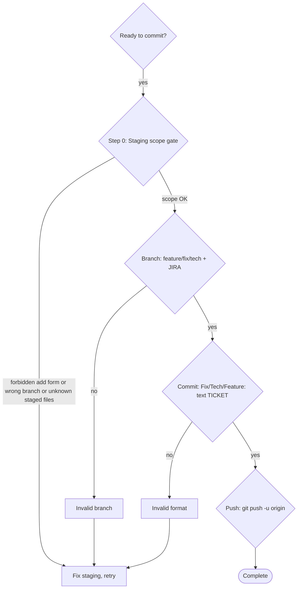

# Committer

## Overview

Four non-negotiable validations before committing: staging scope, branch name format, commit message format, and upstream tracking setup. Skipping any one means starting over.

## When to Use

- You have staged changes and are ready to commit
- You're working on a feature, fix, or technical task
- You need to ensure consistency with project conventions

## The Four Validations



## Step 0: Validate Staging Scope (GATE — runs first)

Before any other validation, confirm that what's about to be staged/committed is intentional and in-scope. This gate prevents the most common class of commit errors: staging unrelated files.

### 0a. Forbidden `git add` forms

**NEVER use:**
- `git add -A` — adds everything, including untracked files
- `git add .` — adds everything in current directory
- `git add -u` — adds all tracked changes (can pull in unrelated modifications)

**Allowed:**
- `git add <explicit-path> [<explicit-path> ...]`
- `git add -p` — interactive hunk-by-hunk selection

If a prior step already used a forbidden form, `git reset` and re-stage explicitly before continuing.

### 0b. Validate staged scope

```bash
git status --short
git diff --cached --stat
```

**Decision:**

- If EVERY staged file corresponds to an edit you (Claude) made in the current session → proceed silently to Step 1.
- If ANY staged file is outside what you touched this session (pre-existing change, untracked file you didn't create, file edited by another tool/session, file you're unsure about) → STOP and ask:

  > "Staged files include changes I didn't make in this session. Confirm each file belongs to [TICKET-ID]'s scope:
  > - `path/file1` — [reason / unknown origin]
  > - `path/file2` — [reason / unknown origin]
  >
  > Proceed, or should I unstage any of these?"

Wait for explicit confirmation before moving on. If the user says to drop a file, `git restore --staged <path>` and re-run Step 0b.

## Step 1: Validate Branch Name (auto-fix when wrong)

```bash
git branch --show-current
```

If the name matches `(feature|fix|tech)/SHAR-XXXXX` → pass, proceed to Step 2.

If NOT (`master`, `main`, `sprint/##`, `hotfix/#.#`, or any non-standard name), **do not commit here**. Offer the user an auto-fix:

> "You're on `<current-branch>`, which isn't a ticket branch. I'll create the right branch and move your work. Which ticket (SHAR-XXXXX) and type (`feature` / `fix` / `tech`)?"

Once the user answers with `<type>` and `<TICKET>`:

### Case A — uncommitted changes (staged or working-tree only)

```bash
git checkout -b <type>/<TICKET>
```

Preserves all staged and working-tree changes. `<current-branch>` is untouched. Then re-run Step 0 on the new branch and proceed to Step 2.

### Case B — already committed on the wrong branch

1. Show the commits that need moving:
   ```bash
   git log --oneline -10
   ```
2. Confirm with the user which N commits belong to this ticket.
3. Create and check out the new branch from current HEAD:
   ```bash
   git branch <type>/<TICKET>
   git checkout <type>/<TICKET>
   ```
4. **Ask for explicit confirmation before rewinding** the original branch (destructive):
   > "Rewind `<current-branch>` by N commit(s) using `git reset --hard`? This cannot be undone without the reflog. Confirm with 'yes, reset <current-branch>'."
5. Only on unambiguous 'yes':
   ```bash
   git checkout <current-branch>
   git reset --hard HEAD~N
   git checkout <type>/<TICKET>
   ```
6. Re-run Step 0 on the new branch, then proceed to Step 2.

### Explicit override (rare, emergencies only)

If the user explicitly insists on committing on the current non-ticket branch (e.g. "yes, commit to master anyway"), document the reason and proceed. Commit message still requires `[TICKET-ID]`.

See **`rules/git-workflow.md`** - Branch Naming Convention section for complete requirements and examples.

## Step 2: Format Commit Message

See **`rules/git-workflow.md`** - Commit Message Format section for complete requirements and examples.

**Quick format:**
```
<Type>: <Description> [<TICKET-ID>]

<Long description of changes - multiple lines encouraged>
```

**DO NOT commit yet.** Just draft the message and verify it matches format.

## Step 3: Commit with Message

```bash
git commit -m "$(cat <<'EOF'
Fix: your description here [TICKET-ID]

Detailed explanation of the changes.
What was changed and why.
Multiple lines are OK and encouraged.
EOF
)"
```

## Step 4: Push with Upstream

**ALWAYS:**
```bash
git push -u origin <branch-name>
```

**Never just** `git push`. The `-u` flag sets upstream tracking explicitly.

**Verify it worked:**
```bash
git branch -vv
```

See **`rules/git-workflow.md`** - Push & Upstream Tracking section for complete details.

## Common Mistakes

See **`rules/git-workflow.md`** - Common Scenarios section for detailed fixes.

| Mistake | Fix |
|---------|-----|
| Used `git add -A` / `git add .` / `git add -u` | `git reset`, then `git add <path>` explicitly per file |
| Staged files that weren't touched this session | Unstage the unrelated files: `git restore --staged <path>` |
| On master/main/sprint/hotfix (not a ticket branch) | Trigger Step 1 auto-fix: `git checkout -b <type>/<TICKET>` (uncommitted) or branch + explicit-confirm reset (committed) |
| Branch has no JIRA ticket | Start over: delete commits, check out correct branch |
| Commit message missing type (Fix/Tech/Feature) | Delete commit with `git reset --soft HEAD~1`, commit again with correct format |
| Missing detailed description | Delete commit, commit again with full message including detailed changes |
| Just ran `git push` without `-u` | Run `git push -u origin <branch>` to set upstream |
| Pushed but tracking not set | Still run `git push -u origin <branch>` - this updates tracking |

## Red Flags - STOP and Start Over

See **`rules/git-workflow.md`** - Red Flags section for detailed information.

These mean your commit is wrong:

- You used a forbidden `git add` form (`-A`, `.`, `-u`)
- Staged set contains files you did not touch in the current session (unconfirmed by user)
- You committed on `master` / `main` / `sprint/##` / `hotfix/#.#` or any non-ticket branch without running Step 1 auto-fix
- Branch name is just `mybugfix` or similar without prefix/ticket
- Commit message doesn't start with Fix/Tech/Feature
- Commit message is missing the ticket ID in brackets
- Commit message is missing detailed description of changes
- You just ran `git push` without the `-u` flag

## The Iron Rule

**All four validations MUST pass before pushing** (staging scope, branch, message format, upstream tracking). Missing even one means:
1. If already committed: delete the commit: `git reset --soft HEAD~1`
2. Fix the issue (scope, branch, message, or tracking)
3. Start from Step 0 again

No exceptions. No shortcuts. No "I'll fix it after". Fix it now.

## Reference: Project Conventions

All conventions are documented in **`rules/git-workflow.md`**:
- Branch naming convention (`feature`, `fix`, `tech` + JIRA ticket)
- Commit message format with examples
- Push with upstream tracking (`-u` flag)
- Pull request guidelines
- Common scenarios and troubleshooting
